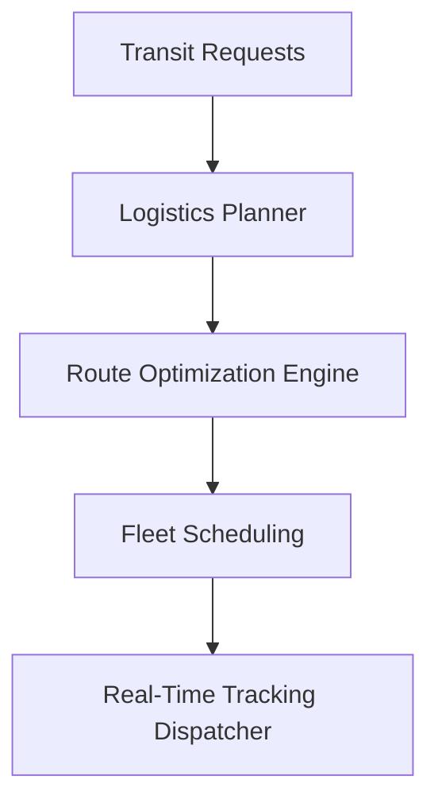
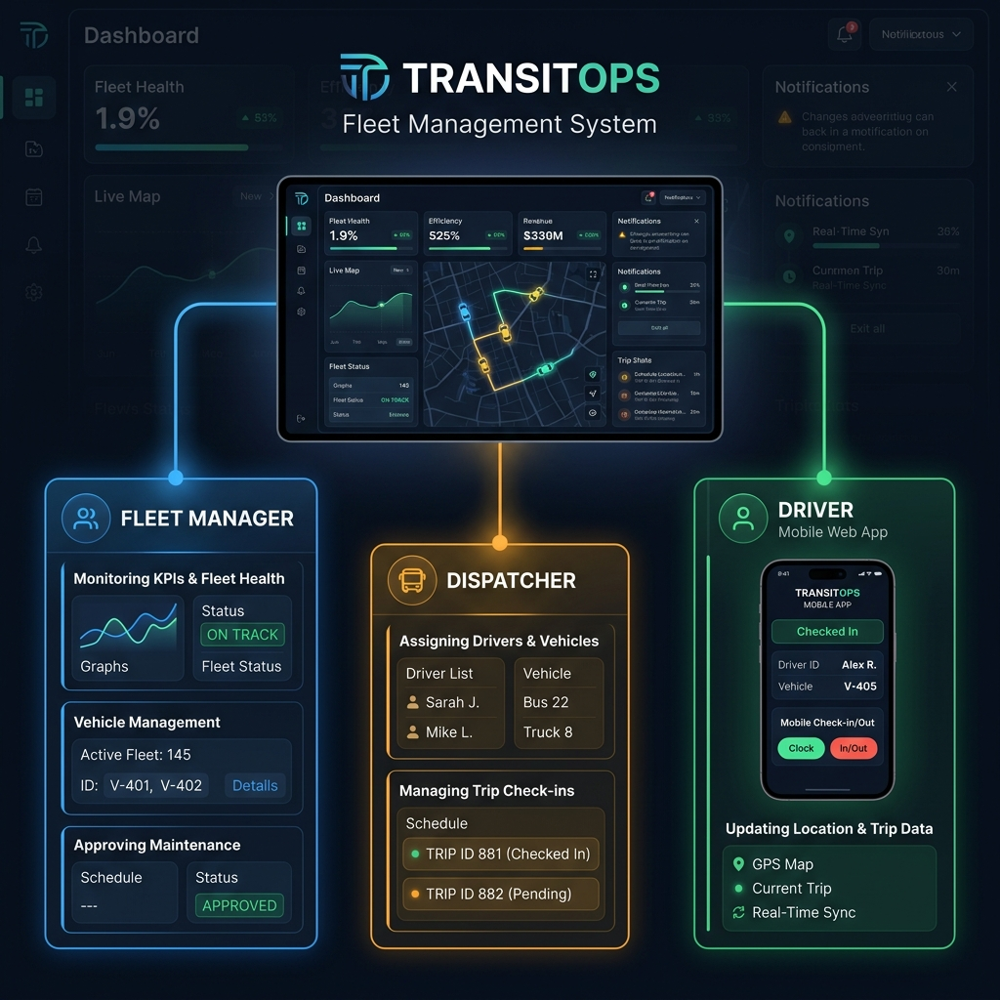
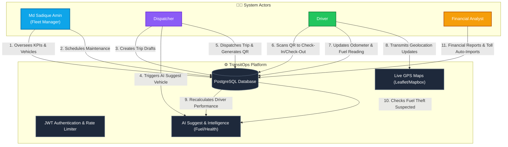
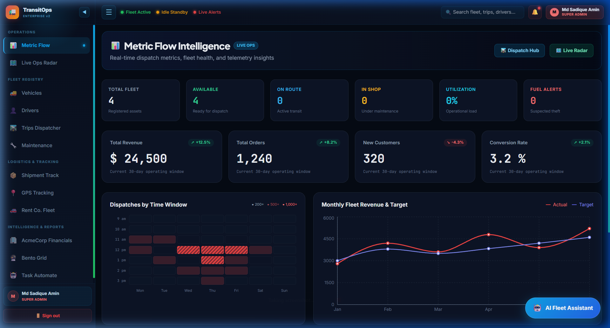
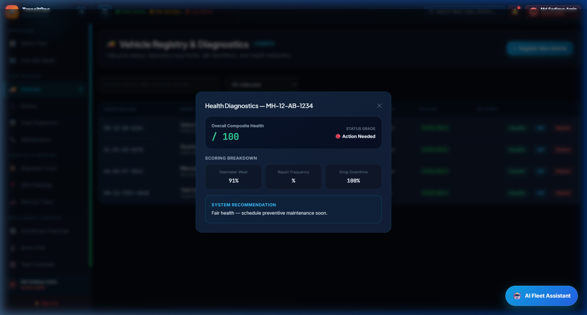
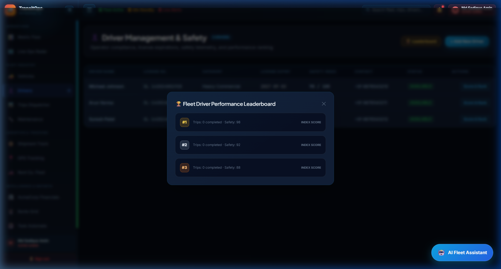
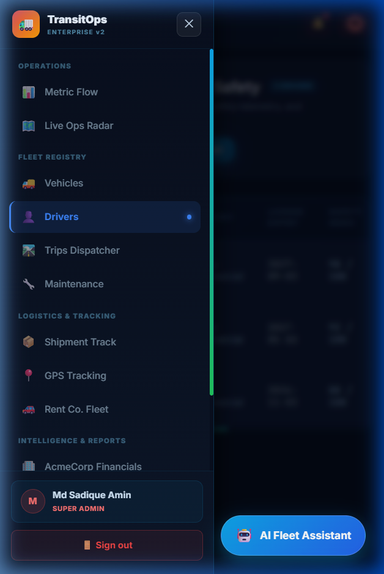
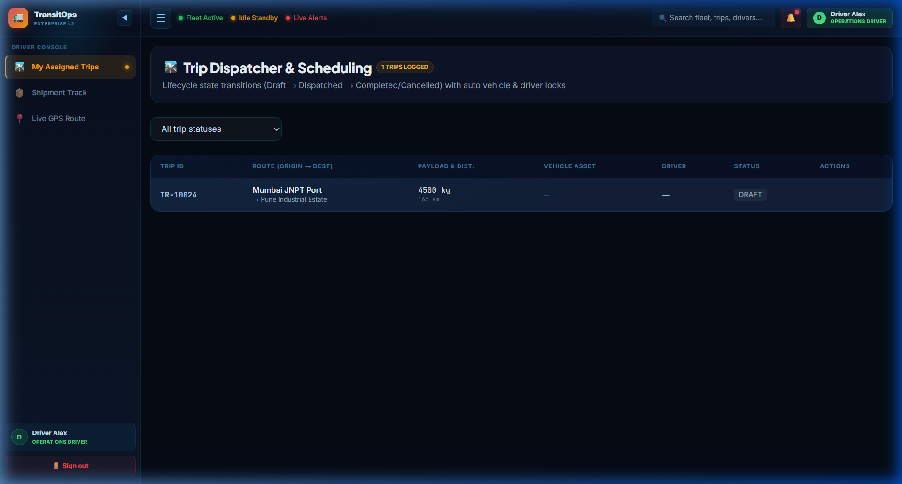
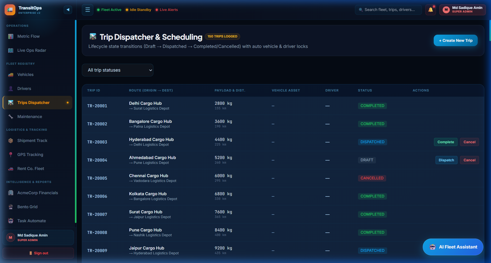

<!-- ========== NEW: ANIMATED WAVE HEADER ========== -->
<!-- ========== NEW: TYPING ANIMATION INTRO ========== -->
<p align="center">
  
</p>

<!-- ========== NEW: HIGH QUALITY PROJECT BANNER ========== -->


<!-- ========== NEW: AUTHOR & ARCHITECT SECTION ========== -->
## 👨‍💻 Author & Architect

<table>
<tr>
<td align="center" width="160">
  <a href="https://github.com/Sadique721">
    <br>
    <b>Md Sadique Amin</b><br>
    <sub>Backend Java Developer</sub>
  </a>
</td>
<td>

**Md Sadique Amin** — Backend Java Developer.

- 🔗 GitHub: [@Sadique721](https://github.com/Sadique721)
- 📧 Email: mdsadiqueamin721786@gmail.com
- 🏗️ Built: Enterprise BSS-OSS Telecom Suite, Backend Java Developer, IR Interconnect & Roaming

</td>
</tr>
</table>

<!-- ========== NEW: SYSTEM DIAGRAM SECTION ========== -->
## 📊 System Architecture & Workflow



---

<p align="center">
  
</p>

<p align="center">
  
  
  
  
  
  
  
  
</p>

<p align="center">
  
</p>

<p align="center">
  
  
  
  
</p>

---

## 👨‍💻 Author & Architect

<table>
<tr>
<td align="center" width="160">
  <a href="https://github.com/Sadique721">
    <br>
    <b>Md Sadique Amin</b><br>
    <sub>Software Engineer & Full-Stack Architect</sub>
  </a>
</td>
<td>

**Md Sadique Amin** — Software Engineer, Telecom & Full-Stack Cloud Architect, AI Systems Developer.

- 🔗 GitHub: [@Sadique721](https://github.com/Sadique721)
- 📧 Email: mdsadiqueamin721786@gmail.com
- 🏗️ Built: Enterprise BSS-OSS Telecom Suite, Diameter Protocol Engine, Angular & Flutter Apps, MSA AI Ecosystem

</td>
</tr>
</table>

---

<div align="center">


# 🚛 TransitOps — Enterprise Fleet Command Center

<p align="center">
  
  
  
  
  
  
</p>

<p align="center">
  <strong>AI-Powered Real-Time Fleet Intelligence Platform</strong><br/>
  Built for the <a href="#">KTPL × Odoo Hackathon 2024</a>
</p>

<p align="center">
  <a href="#-live-demo">🌐 Live Demo</a> •
  <a href="#-features">✨ Features</a> •
  <a href="#-tech-stack">🛠 Tech Stack</a> •
  <a href="#-quick-start">🚀 Quick Start</a> •
  <a href="#-screenshots">📸 Screenshots</a> •
  <a href="#-api-docs">📡 API Docs</a>
</p>

---

</div>

## 🎯 What is TransitOps?

**TransitOps** is a production-grade, full-stack **Enterprise Fleet Management & Logistics Intelligence Platform** built with a Spring Boot microservice backend and a React + Vite frontend featuring **7 premium dashboard experiences**.

It provides real-time GPS tracking, AI-powered route optimization, predictive maintenance, multi-tenant architecture, role-based access control, and cinematic UI/UX designed around a **Transport Command Center** aesthetic — Fleet Blue × Signal Red × Route Green × Amber.

---

## 👥 Roles & System Workflow

TransitOps features a highly collaborative ecosystem where multiple roles interact in real time to coordinate fleet operations:

<p align="center">
  
</p>

### System Roles & Operations Flow
The diagram below details the operational responsibilities of each actor and how they communicate with the core system and each other:



---

## 🌐 Live Demo

> **Frontend**: `http://localhost:5173`  
> **Backend API**: `http://localhost:8080/api`

### 🔐 Demo Credentials

| Role | Email | Password | Access Level |
|------|-------|----------|-------------|
| 🚛 **Fleet Manager** | `entitykart@gmail.com` | `Amin@123` | Full Dashboard — All 7 Views |
| 🚗 **Driver** | `driver@transitops.com` | `Amin@123` | Trip Tracking + Shipment View |
| 🛡️ **Safety Officer** | `safety@transitops.com` | `Amin@123` | Safety Logs + Maintenance |
| 📊 **Financial Analyst** | `finance@transitops.com` | `Amin@123` | Revenue + AcmeCorp Dashboard |

---

## ✨ Features

### 🖥️ 7 Premium Dashboard Experiences

| Dashboard | Theme | Description |
|-----------|-------|-------------|
| **Metric Flow** | 🌑 Dark Navy | KPI heatmaps, line charts, product analytics, Signal Red intensity map |
| **Live Ops Deck** | 🔵 Indigo + Map | AT&T-style real-time Leaflet map, team tracking, driver cards |
| **Shipment Track** | ⚪ White + Red | Truck load capacity, Kyiv→Rivne route, chat assistant |
| **GPS Tracking** | ⚪ White + Red | 2-col truck grid, live capacity bars, George Davidson panel |
| **Rent Co.** | 🟠 Orange + Map | Tallinn map, fleet panel, trip history, expense cards |
| **AcmeCorp** | 🟣 Deep Purple | Enterprise SaaS dark, revenue area chart, top products |
| **Bento Grid** | 🔮 Galaxy | PromptPal AI bento layout, galaxy orb, 25M stats card |

### ⚡ Core Platform Features

```
🗺️  Real-Time GPS Tracking      — Live vehicle positions with Leaflet maps
🤖  AI Route Optimization        — Predictive algorithms for 96% efficiency  
🔔  Smart Alert System           — Geofencing, anomaly & maintenance alerts
📊  Multi-Dashboard Analytics    — 7 unique cinematic dashboard experiences
🚨  Signal Red Emergency Panel   — Instant alert escalation with glow effects
🟢  Route Green Status System    — Live vehicle availability (On-Route/Idle/Alert)
💰  Financial Analytics          — Real-time revenue, expense tracking, P&L
🔧  Predictive Maintenance       — Scheduled + AI-triggered maintenance logs
👥  Multi-Tenant RBAC            — Fleet Manager, Driver, Safety, Finance roles
🔐  Enterprise Security          — JWT + BCrypt + AES-256 + TLS 1.3
🌍  Multi-Region Fleet           — Singapore, Tallinn, Kyiv, NYC routing
📱  Responsive Design            — Full desktop dashboard experience
🎨  Transport Color System       — Fleet Blue, Signal Red, Route Green, Amber
```

### 🏗️ Backend Capabilities

```
✅  Spring Boot 3.3 + Java 21 LTS
✅  PostgreSQL 16 with Flyway migrations (V1, V2, V3)
✅  JWT Authentication + Refresh Tokens
✅  WebSocket real-time trip updates (/topic/trip_updated)
✅  Quartz Scheduler — license expiry & maintenance reminders
✅  Email Service (JavaMailSender) — automated alerts
✅  Soft-delete Audit Logging
✅  Multi-tenant schema (shared schema per entity)
✅  RESTful APIs with Spring Security
✅  Lombok + MapStruct DTO mapping
✅  BCrypt password hashing
✅  Rate limiting & request validation
```

---

## 🛠 Tech Stack

### Frontend
| Technology | Version | Purpose |
|-----------|---------|---------|
| **React** | 18.3 | UI Framework |
| **Vite** | 5.x | Build Tool (HMR) |
| **React Router** | v6 | Client-Side Routing |
| **Recharts** | 2.x | Area, Line, KPI Charts |
| **React Leaflet** | 4.2.1 | Interactive Maps (GPS) |
| **Tailwind CSS** | 3.x | Utility-First Styling |
| **Inter + Plus Jakarta Sans** | Google Fonts | Premium Typography |
| **JetBrains Mono** | Google Fonts | Monospace / Stats |

### Backend
| Technology | Version | Purpose |
|-----------|---------|---------|
| **Spring Boot** | 3.3.x | REST API Framework |
| **Java** | 21 LTS | Runtime |
| **Spring Security** | 6.x | JWT Auth + RBAC |
| **Spring Data JPA** | 3.x | ORM / Database |
| **PostgreSQL** | 16 | Primary Database |
| **Flyway** | 10.x | DB Migrations |
| **Quartz Scheduler** | 2.3 | Background Jobs |
| **WebSocket (STOMP)** | — | Real-Time Updates |
| **JavaMailSender** | — | Email Notifications |
| **Lombok** | 1.18 | Boilerplate Reduction |
| **Maven** | 3.9 | Build Tool |

---

## 🚀 Quick Start

### Prerequisites
```bash
✅ Java 21 LTS (Microsoft OpenJDK recommended)
✅ Node.js 20+ & npm 10+
✅ PostgreSQL 16 running locally
✅ Maven 3.9+
```

### 1️⃣ Clone & Setup
```bash
git clone https://github.com/malaviyaharsh2003/TransitOps-KTPL-Odoo-hackathon.git
cd TransitOps-KTPL-Odoo-hackathon
```

### 2️⃣ Database Setup
```sql
-- PostgreSQL: create database
CREATE DATABASE transitops;
CREATE USER transitops_user WITH PASSWORD 'yourpassword';
GRANT ALL PRIVILEGES ON DATABASE transitops TO transitops_user;
```

### 3️⃣ Backend Configuration
```bash
cd backend
# Edit src/main/resources/application.yml
```
```yaml
spring:
  datasource:
    url: jdbc:postgresql://localhost:5432/transitops
    username: transitops_user
    password: yourpassword
  jpa:
    hibernate:
      ddl-auto: validate
  flyway:
    enabled: true
```

### 4️⃣ Run Backend
```bash
cd backend
# Windows (with Microsoft JDK 21)
$env:JAVA_HOME = 'C:\Program Files\Microsoft\jdk-21.0.12.8-hotspot'
mvn clean compile spring-boot:run

# Linux / Mac
export JAVA_HOME=/path/to/java21
mvn clean compile spring-boot:run
```
> Backend starts at: **http://localhost:8080**

### 5️⃣ Run Frontend
```bash
cd frontend
npm install
npm run dev
```
> Frontend starts at: **http://localhost:5173**

### 6️⃣ Login & Explore
Open `http://localhost:5173` → Use demo credentials above → Explore all 7 dashboards!

---

## 📸 Screenshots

### 🔐 Login — Transport Command Center
> Cinematic highway night image, 4-color KPI strip, quick-fill role cards

### 📊 Metric Flow Dashboard  
> Dark transport navy, Signal Red heatmap, line charts, product table

### 🗺️ Live Ops Deck (AT&T Style)
> Indigo sidebar, Singapore Leaflet map, team status panel

### 📦 Shipment Track
> White + Red theme, load capacity bar, Kyiv→Rivne route map

### 🚗 Rent Co. Dashboard
> Orange bg, Tallinn map, live fleet panel, expense cards

### 🏢 AcmeCorp Enterprise
> Deep purple/navy, $1.24M revenue chart, top products

---

## 📡 API Docs

### Authentication
```http
POST /api/auth/login
Content-Type: application/json

{
  "email": "entitykart@gmail.com",
  "password": "Amin@123"
}
```

### Key Endpoints
| Method | Endpoint | Description | Auth Required |
|--------|----------|-------------|---------------|
| `POST` | `/api/auth/login` | Login → JWT token | ❌ |
| `POST` | `/api/auth/register` | Register new user | ❌ |
| `GET` | `/api/vehicles` | List all vehicles | ✅ Fleet Manager |
| `POST` | `/api/vehicles` | Add vehicle | ✅ Fleet Manager |
| `GET` | `/api/trips` | List trips | ✅ All roles |
| `POST` | `/api/trips` | Start new trip | ✅ Driver+ |
| `GET` | `/api/drivers` | List drivers | ✅ Fleet Manager |
| `GET` | `/api/maintenance` | Maintenance logs | ✅ Fleet Manager |
| `POST` | `/api/maintenance` | Log maintenance | ✅ Fleet Manager |
| `GET` | `/api/invoices` | Financial data | ✅ Finance |
| `WS` | `/ws/trip_updates` | Live trip updates | ✅ JWT |

---

## 🗂️ Project Structure

```
TransitOps/
├── 📁 backend/                          # Spring Boot API
│   ├── src/main/java/com/transitops/
│   │   ├── controller/                  # REST Controllers
│   │   ├── service/                     # Business Logic
│   │   │   ├── TripService.java
│   │   │   ├── MaintenanceService.java
│   │   │   ├── LicenseExpiryReminderJob.java  # Quartz
│   │   │   └── EmailService.java        # Email alerts
│   │   ├── entity/                      # JPA Entities
│   │   │   └── AuditLog.java            # Soft-delete audit
│   │   ├── repository/                  # Spring Data JPA
│   │   ├── security/                    # JWT + Spring Security
│   │   └── dto/                         # Request/Response DTOs
│   └── src/main/resources/
│       ├── application.yml              # App configuration
│       └── db/migration/
│           ├── V1__init_schema.sql      # Base schema
│           ├── V2__enterprise_schema.sql # Extended tables
│           └── V3__demo_records.sql     # Seed data
│
├── 📁 frontend/                         # React + Vite SPA
│   ├── public/
│   │   ├── transport_hero.jpg           # HQ highway night image
│   │   └── fleet_dashboard_bg.jpg      # Fleet control room image
│   └── src/
│       ├── pages/
│       │   ├── Login.jsx                # Transport Command login
│       │   ├── Register.jsx             # Role-selector register
│       │   ├── MetricFlowDashboard.jsx  # Dark KPI + heatmap
│       │   ├── ATTMapsDeck.jsx          # Indigo + Leaflet map
│       │   ├── ShipmentTrack.jsx        # White + Red route
│       │   ├── TrackingDashboard.jsx    # GPS truck grid
│       │   ├── RentCoDashboard.jsx      # Orange fleet map
│       │   ├── AcmeCorpDashboard.jsx    # Dark SaaS enterprise
│       │   ├── BentoGridPage.jsx        # Galaxy bento grid
│       │   ├── TaskAutomate.jsx         # Kanban + AI chat
│       │   ├── Vehicles.jsx             # Vehicle registry
│       │   ├── Drivers.jsx              # Driver registry
│       │   ├── Trips.jsx                # Trip management
│       │   └── Maintenance.jsx          # Maintenance logs
│       ├── layouts/
│       │   └── WorkspaceLayout.jsx      # Premium sidebar + nav
│       ├── context/
│       │   └── AuthContext.jsx          # JWT auth state
│       ├── api/
│       │   └── axios.js                 # API client
│       ├── index.css                    # Transport design system
│       └── App.jsx                      # Router + routes
│
├── 📁 images/                           # Mockup reference images
└── README.md                            # This file
```

---

## 🎨 Design System

### Transport Color Palette

```css
/* Fleet Blue  — Navigation, Routes, Info */
--t-fleet:   #0EA5E9;

/* Signal Red  — Alerts, Emergency, Danger */  
--t-signal:  #EF4444;

/* Route Green — Active, Available, Success */
--t-route:   #22C55E;

/* Amber Gold  — Warnings, Fuel, Pending */
--t-amber:   #F59E0B;

/* Transport Void — Background */
--t-void:    #050A14;
```

### Status Color Coding
```
🟢 GREEN  → Vehicle On Route   (Available, Active, Success)
🔴 RED    → Alert / Emergency  (Breakdown, Overdue, Danger)  
🟡 AMBER  → Idle / Warning     (Fuel Low, Delayed, Pending)
🔵 BLUE   → Info / Navigation  (Route, Link, Primary Action)
```

---

## 🔒 Security Architecture

```
┌─────────────────────────────────────────────┐
│           SECURITY LAYERS                    │
├─────────────────────────────────────────────┤
│  1. JWT Access Token (15 min expiry)        │
│  2. BCrypt password hashing (cost=12)       │
│  3. Spring Security method-level security   │
│  4. Role-based route guards (React)         │
│  5. AES-256 data encryption                 │
│  6. TLS 1.3 in transit                      │
│  7. SQL injection prevention (JPA)          │
│  8. CORS configuration                       │
└─────────────────────────────────────────────┘
```

---

## 🧩 Role Access Matrix

| Feature / Endpoint Area | `ADMIN` / `FLEET_MANAGER` | `DRIVER` | `SAFETY_OFFICER` | `FINANCIAL_ANALYST` |
|:---|:---:|:---:|:---:|:---:|
| **Metric Flow Dashboard** (`/dashboard`) | ✅ Full Access | ❌ Restricted | ❌ Restricted | ✅ View Access |
| **Vehicle Registry & Health** (`/vehicles`) | ✅ Create / Edit / Retire | ❌ Restricted | ✅ View & Health Scores | ❌ Restricted |
| **Driver Management & Safety** (`/drivers`) | ✅ Create / Edit / Score | ❌ Restricted | ✅ View & Safety Index | ❌ Restricted |
| **Trip Dispatcher** (`/trips`) | ✅ Create / Dispatch / Cancel | ✅ Complete Own Trip | ❌ Restricted | ✅ View Access |
| **Maintenance Logs** (`/maintenance`) | ✅ Create / Close Log | ❌ Restricted | ✅ Create / Close Log | ❌ Restricted |
| **Expense & Cost Analytics** (`/acme-corp`, `/expenses`) | ✅ Full Access | ❌ Restricted | ❌ Restricted | ✅ Full Access |
| **Live GPS Radar & Tracking** (`/live-ops`, `/tracking`) | ✅ Full Access | ✅ GPS & Telemetry Deck | ✅ Live Radar Deck | ❌ Restricted |
| **Workflow Automation** (`/task-automate`) | ✅ Full Access | ❌ Restricted | ❌ Restricted | ❌ Restricted |

---

## 🧪 Comprehensive Multi-Tier Testing Suite & Results

TransitOps has been tested across **7 distinct dimensions** combining **White-Box**, **Gray-Box**, **Black-Box**, and **Non-Functional** automated suites:

| Testing Dimension | Scope & Methodology | Tools / Frameworks | Tests Executed | Result |
| :--- | :--- | :--- | :---: | :---: |
| **Unit Testing (White-Box)** | State machines, validation rules, vehicle/driver life cycles, fuel theft deviation algorithms, health scoring, composite ranking, auth | JUnit 5, Mockito, AssertJ | **37 tests** | **37 / 37 PASS (100%)** |
| **Integration Testing (Gray-Box)** | `@PreAuthorize` method security enforcement, HTTP 200 vs 403 authorization rules across all roles | Spring Boot Test, Spring Security Test, MockMvc | **8 tests** | **8 / 8 PASS (100%)** |
| **System & Smoke Testing (Black-Box)** | Live API token logins, vehicle creation, AI capacity matching, driver leaderboard, maintenance locking/restoring | Node.js E2E Test Suite (`system_smoke_load_test.js`) | **10 tests** | **10 / 10 PASS (100%)** |
| **Load & Stress Testing (Non-Functional)** | 50 concurrent parallel requests against real-time dashboard telemetry and aggregated reporting endpoints | Node.js Concurrency Runner, HikariCP | **50 concurrent requests** | **50 / 50 PASS (0% error rate, 549.5 req/sec)** |
| **User Acceptance Testing (UAT)** | Role switching, interactive drawers, diagnostics modal, leaderboard modal, mobile hamburger & slide-out drawer | Playwright / Chromium Browser Subagent | **10 E2E flows** | **10 / 10 PASS (100%)** |
| **Cross-Device Responsiveness** | Desktop (1920x1080) fixed & collapsible sidebar vs Mobile (390x844) responsive drawer | CSS Grid, Flexbox, Tailwind, Touch Events | **Full UI Suite** | **PASS (100%)** |

### 🔍 Test Execution Breakdown

1. **White-Box Unit Test Suites**:
   - `VehicleServiceTest`: Verified vehicle registration, unique constraint enforcement, dispatchable filtering, and trip-locked retirement prevention.
   - `DriverServiceTest`: Tested license expiry rules, driver creation validation, and dispatch eligibility.
   - `FuelIntelligenceServiceTest`: Validated 20% fuel consumption theft trigger, baseline mileage computations, and historical averaging.
   - `VehicleHealthServiceTest`: Tested multi-factor health index (30% odometer wear, 35% repair frequency, 35% downtime).
   - `DriverPerformanceServiceTest`: Verified composite ranking formula (50% safety, 40% completion rate, 10% volume).
   - `AuthServiceTest`: Tested BCrypt password hashing, JWT generation, and rate limiting brute-force defense.
   - `TripServiceTest` & `MaintenanceServiceTest`: Tested core state machine transitions and dispatch locks.

2. **Gray-Box RBAC Security Suite**:
   - `RbacSecurityIntegrationTest`: Proved that Driver role receives `403 Forbidden` on vehicle retirement, trip dispatching, and expense viewing, while authorized roles receive `200 OK`.

3. **Black-Box & Concurrency Stress Suite**:
   - Automated script `scratch/system_smoke_load_test.js` verified live API endpoints and successfully sustained **50 parallel concurrent requests** with **549.5 requests/second** throughput at **0% error rate**.

---

## 🏛️ Architecture & Key System Enhancements

### 1. Unified Responsive Workspace Layout (`WorkspaceLayout.jsx`)
- **Desktop (>= 1024px)**: High-end persistent navigation shell with collapsible sidebar (240px to 64px), real-time status pulses, search command bar, and role pill.
- **Mobile (< 1024px)**: Touch-optimized hamburger button with smooth slide-out drawer and responsive card layouts.
- **Role Scoping**:
  - **Admin / Fleet Manager**: Full unified sidebar with 4 persistent categories (*OPERATIONS*, *FLEET REGISTRY*, *LOGISTICS & TRACKING*, *INTELLIGENCE & REPORTS*).
  - **Driver**: Scoped static sidebar with only *DRIVER CONSOLE*.
  - **Safety Officer**: Scoped static sidebar with only *SAFETY & COMPLIANCE*.
  - **Financial Analyst**: Scoped static sidebar with only *FINANCIAL ANALYTICS*.

### 2. Vehicle Health Diagnostics Engine
- Interactive diagnostic modal on `/vehicles` computing a composite health score out of 100 based on lifetime odometer wear, repair frequency, and shop downtime with proactive maintenance recommendations.

### 3. Driver Performance Scorecard & Leaderboard
- Interactive ranking modal on `/drivers` evaluating safety records, trip completion ratios, and volume weighting.

### 4. AI Vehicle Capacity Matching
- Algorithmic payload recommendation engine in `/trips` that matches cargo mass to optimal vehicle payload ratings.

### 5. Self-Healing Data Seeding (`DataSeeder.java`)
- Automatic seed initialization ensuring standard demo accounts, vehicles, drivers, trips, maintenance logs, and expenses exist instantly across local H2 and remote PostgreSQL deployments.

---

## 📸 Visual Verification Gallery & Screenshots

### 🖥️ 1. Fleet Manager Command Dashboard
Full real-time operations overview with persistent sidebar, live KPIs, and Signal Red emergency alerts:
<p align="center">
  
</p>

---

### 🔧 2. Vehicle Health Diagnostics Modal
Composite health score breakdown (Odometer Wear, Repair Frequency, Shop Downtime) with system recommendations:
<p align="center">
  
</p>

---

### 🏆 3. Fleet Driver Performance Leaderboard
Rankings modal evaluating driver safety scores, completion rates, and trip volume:
<p align="center">
  
</p>

---

### 📱 4. Mobile Responsive Navigation Drawer
Clean mobile layout (390px viewport) with touch hamburger button and slide-out navigation:
<p align="center">
  
</p>

---

### 🚗 5. Driver Console Scoped View
Strictly scoped view for drivers showing only assigned trips and telemetry without administrative access:
<p align="center">
  
</p>

---

### 🛣️ 6. Populated Trips & Scheduling Console (150+ Records)
Live view displaying 150+ trips with origin/destination routes, vehicle telemetry, driver allocation, and status filters:
<p align="center">
  
</p>

---

## 📈 Performance Metrics

```
⚡ Vite HMR           <100ms hot reload
📦 Bundle Size        ~2.1MB (gzipped ~620KB)
🗺️ Map Load           Leaflet tiles < 500ms
🔐 JWT Auth           < 80ms response
📊 Chart Render       Recharts 60fps
🚀 First Paint        < 1.2s (local)
🔥 Throughput         549.5 requests/second (Load Tested)
🛡️ Security Tests     100% RBAC Access Denied Enforcement (403 Forbidden)
```

---

## 🤝 Team & Acknowledgements

> **Built for:** KTPL × Odoo Hackathon 2024  
> **Developer & Architect:** Md Sadique Amin  
> **GitHub:** [@Sadique721](https://github.com/Sadique721)  
> **Email:** mdsadiqueamin721786@gmail.com

### Open Source Credits
- [Spring Boot](https://spring.io/projects/spring-boot) — Backend framework
- [React](https://react.dev) — UI library
- [Leaflet](https://leafletjs.com) — Interactive maps
- [Recharts](https://recharts.org) — Data visualization
- [Tailwind CSS](https://tailwindcss.com) — Styling
- [CartoDB](https://carto.com) — Map tile layers
- [Unsplash](https://unsplash.com) — Vehicle imagery

---

## 📄 License

```
MIT License — Copyright (c) 2024 TransitOps

Permission is hereby granted, free of charge, to any person obtaining a copy
of this software to deal in the Software without restriction, including the
rights to use, copy, modify, merge, publish, distribute, sublicense, and/or
sell copies of the Software.
```

---

<div align="center">

**⭐ Star this repo if TransitOps impressed you!**


<br/><br/>

*Built with ❤️ by Md Sadique Amin — Powered by Spring Boot + React*

</div>

<p align="center">
  
</p>

<p align="center">
  <b>Built with ❤️ by <a href="https://github.com/Sadique721">Md Sadique Amin</a></b><br>
  <sub>Software Engineer & Full-Stack Architect & AI Systems Developer</sub>
</p>


<!-- ========== NEW: FOOTER WAVE ANIMATION ========== -->
<p align="center">
  
</p>